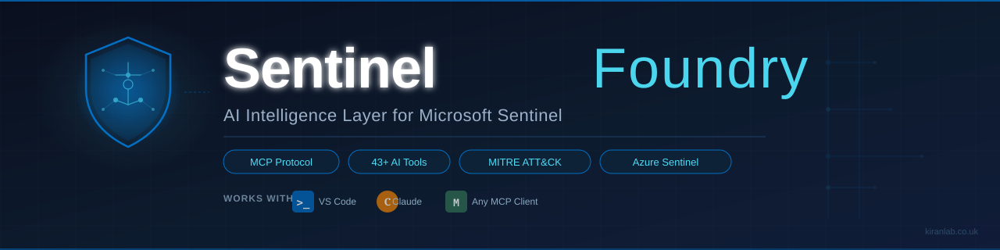

# Sentinel Foundry — MCP Agent (Preview)

**Sentinel Foundry** is an AI intelligence layer for Microsoft Sentinel, delivered as a live [Model Context Protocol (MCP)](https://modelcontextprotocol.io) server.

Connect directly from VS Code Copilot Chat or Claude Desktop and talk to your Sentinel workspace in plain English — no dashboards, no KQL required.

`Note: This is currently in the final phases of testing, but the public preview will be available from 30/04/2026`

---

## What can it do?

The agent exposes **43 tools** across every dimension of Sentinel operations, including a reasoning engine that diagnoses *why* your workspace is in its current state. Ask questions like in a conversation:

| What you say | What the agent does |
|---|---|
| *"What are our top cost drivers this month?"* | Reads Azure billing data, breaks down ingestion GB and spend by table |
| *"Do we have any detection gaps against MITRE ATT&CK?"* | Maps all 14 ATT&CK v18 tactics across 77 techniques, surfaces uncovered areas |
| *"Which detection rules are causing the most noise?"* | Analyses 30 days of alert data, finds high-FP rules, provides KQL patches |
| *"Give me our full security health score"* | Scores Data, Detection, Automation, Cost, and Operations pillars |
| *"What workbooks are we missing?"* | Cross-references your data sources against workbook coverage |
| *"Suggest automations we should build"* | Analyses incident patterns, returns Logic App ARM templates ready to deploy |
| *"Generate a full security posture report"* | Produces a self-contained HTML report with score rings, metric cards, and print-to-PDF support |
| *"Why does our workspace score so low?"* | Runs root-cause diagnosis across all pillars — 10 correlation rules identify the real reasons |
| *"Would we detect a ransomware attack right now?"* | Simulates a named attack scenario against live data, returns pass/fail per MITRE technique |
| *"Write a board summary of our security posture"* | Generates an audience-calibrated narrative: board / CISO / SOC / technical |

---

## Tool Categories

<details>
<summary><strong>🔎 Schema & Tables (5 tools)</strong></summary>

| Tool | What it does |
|---|---|
| `list_tables` | Lists all Log Analytics tables in your workspace with row counts and last-updated timestamps — plus all 38 Defender XDR tables when `X-Security-Token` is configured |
| `get_schema` | Returns full column schema for any table (Log Analytics or Defender XDR) |
| `get_sample_logs` | Returns recent sample rows from a table — progressive fallback P1D→P7D→P30D→P90D for LA tables; 7-day Timestamp filter via Graph API for Defender XDR tables |
| `list_data_connectors` | Lists all configured data connectors with health status |
| `classify_tables` | Categorises tables by security domain (Identity, Endpoint, Network, Cloud, Application) |

</details>

<details>
<summary><strong>❤️ Health & Security Posture (4 tools)</strong></summary>

| Tool | What it does |
|---|---|
| `analyze_sentinel_health` | Full health report: connector gaps, disabled rules, stale data, misconfigurations |
| `calculate_security_score` | Weighted Secure Vision Score (0–100) across 6 pillars with per-pillar evidence |
| `run_daily_assessment` | Lightweight daily posture check — faster snapshot than full score calculation |
| `get_score_trend` | Returns score history for trend analysis over N days |

</details>

<details>
<summary><strong>🧠 Reasoning & Intelligence (5 tools)</strong></summary>

| Tool | What it does |
|---|---|
| `diagnose_workspace` | **Primary reasoning tool** — runs all modules in parallel, applies 10 correlation rules to identify root causes with score-impact estimates |
| `analyze_value_efficiency` | Cross-references ingestion cost against active detection rules — exposes tables paid for but not detected against |
| `simulate_attack` | Maps 77 MITRE ATT&CK v18 techniques across 11 scenarios to available tables and enabled rules — returns a readiness verdict |
| `generate_narrative` | Produces audience-calibrated narrative from session findings: board / CISO / SOC / technical |
| `get_session_context` | Returns all findings cached this session so subsequent prompts avoid re-querying Azure |

</details>

<details>
<summary><strong>🛡️ Detection & MITRE ATT&CK (10 tools)</strong></summary>

| Tool | What it does |
|---|---|
| `list_detection_rules` | All analytic rules with status, MITRE mapping, and optional quality filter |
| `analyze_detection_coverage` | Full MITRE ATT&CK v18 coverage heatmap across all 14 enterprise tactics |
| `detect_gaps` | Identifies highest-priority uncovered tactics with business-impact explanation |
| `score_detection_quality` | Per-rule quality scores across 5 dimensions (KQL, severity, entity mapping, MITRE, freshness) |
| `analyze_incidents` | Incident volume, MTTR, false-positive rate, top noisy rules, closure patterns |
| `tune_detection_rules` | 30-day alert + FP cross-reference → specific KQL exclusion patches with real entity values |
| `suggest_detection_rules` | Generates ready-to-deploy KQL rules for the top uncovered MITRE techniques |
| `suggest_hunting_queries` | Returns runnable KQL hunting queries for tables available in your workspace |
| `generate_detection_rule` | AI-generates a new Sentinel analytics rule (name, KQL, severity, MITRE mapping) |
| `generate_kql` | Generates ad-hoc KQL for any security investigation question |

</details>

<details>
<summary><strong>💰 Cost & Waste (3 tools)</strong></summary>

| Tool | What it does |
|---|---|
| `analyze_cost` | Reads actual billed GB from Azure Usage — monthly estimate, per-table breakdown, regional pricing |
| `detect_waste` | Identifies over-ingested tables, verbose sources, and zero-value data streams |
| `suggest_cost_optimizations` | Ranked savings plan with £ estimates and effort ratings |

</details>

<details>
<summary><strong>📊 Workbooks (4 tools)</strong></summary>

| Tool | What it does |
|---|---|
| `list_workbooks` | All deployed Sentinel workbooks with metadata |
| `analyze_workbooks` | Coverage gaps and stale workbook review |
| `suggest_workbooks` | Recommended workbooks to build based on available data sources |
| `generate_workbook` | Generates a Sentinel workbook ARM template for a given use case |

</details>

<details>
<summary><strong>🤖 Automation & Response (4 tools)</strong></summary>

| Tool | What it does |
|---|---|
| `suggest_automations` | Reads incident history, scores scenarios, returns top 3 with ready-to-deploy Logic App ARM templates |
| `suggest_notebooks` | Checks available tables and returns which Jupyter notebook scenarios are ready to run |
| `generate_playbook` | Generates a Logic App playbook ARM template for a named incident response scenario |
| `generate_notebook` | Generates a Jupyter notebook for a named investigation workflow |

</details>

<details>
<summary><strong>📋 Reporting (3 tools)</strong></summary>

All reports default to **self-contained HTML** — professional design with score rings, metric cards, and print-friendly CSS. After every report the agent offers PDF export instructions (File → Print → Save as PDF).

| Tool | What it does |
|---|---|
| `generate_executive_report` | Full executive report — score, findings, risk assessment, recommendations |
| `generate_soc_report` | SOC operations report — incident analysis, alert fatigue, tuning recommendations |
| `generate_engineering_report` | Engineering deep-dive — detection coverage, rule quality, KQL improvements |

</details>

<details>
<summary><strong>⚙️ Improvements (2 tools)</strong></summary>

| Tool | What it does |
|---|---|
| `suggest_improvements` | General improvement recommendations across all pillars, prioritised by impact and effort |
| `assess_table` | Deep assessment of a single table — coverage, quality, cost contribution |

</details>

<details>
<summary><strong>📡 Monitoring (2 tools)</strong></summary>

| Tool | What it does |
|---|---|
| `run_daily_assessment` | Lightweight daily posture check with trend comparison |
| `get_score_trend` | Score history and trend analysis over a configurable number of days |

</details>

<details>
<summary><strong>🔧 Workspace Management (3 tools)</strong></summary>

| Tool | What it does |
|---|---|
| `discover_workspaces` | Auto-detects all Sentinel workspaces the signed-in user has access to |
| `set_workspace` | Manually connect to a specific workspace by subscriptionId, resourceGroup, name |
| `get_workspace` | Shows which workspace is currently active |

</details>

---

## Connect in 2 minutes
To add the Sentinel Foundry collection, first set up the MCP server interface. Follow the step-by-step instructions for the compatible AI-powered code editors and agent-building platforms.
The Sentinel Foundry collection is hosted at the following URL:
```json

https://mcp.kiranlab.co.uk/sentinel

```

### VS Code Copilot (recommended)
To add Sentinel Foundry custom tools in Visual Studio Code, follow these steps:

1. Add MCP server:

   a. Press Ctrl + Shift + P then type or choose MCP: Add Server.

   
   
   b. Choose HTTP (HTTP or Server-Sent Events).

   
   
   c. Enter the URL as `https://mcp.kiranlab.co.uk/sentinel` to add our custom tools, then press Enter.

   d. Assign a friendly Server ID (for example, Sentinel Foundry - MCP server)
   
   e. Choose whether to make the server available in all Visual Studio Code workspaces or just the current one.
   
3. Allow authentication. When prompted, select Allow to authenticate with an account that has at least the **Microsoft Sentinel Reader** and **Log Analytics Reader** roles.

   
   
4. Open Visual Studio Code's chat. Select View > Chat, select the Toggle Chat icon  beside the search bar, or press Ctrl + Alt + I.
5. Verify connection. Set the chat to Agent mode, then confirm by selecting the Configure Tools icon that you see added under the MCP server.

   
   
6. The agent auto-detects your Sentinel workspace from your signed-in Azure account
7. Start asking questions

   (or alternatively)
   
1. Open **Settings** (`Ctrl+,`) → search **MCP**
2. Click **Edit in settings.json** and add:

```json
{
  "mcp": {
    "servers": {
      "sentinel": {
        "name": "Sentinel Foundry - MCP Server",
        "url": "https://mcp.kiranlab.co.uk/sentinel",
        "type": "http"
      }
    }
  }
}
```
3. Open **Copilot Chat** → switch to **Agent mode** (the `@` icon)
4. The agent auto-detects your Sentinel workspace from your signed-in Azure account
5. Start asking questions

> **Authentication:** The agent uses your existing VS Code Azure sign-in. No extra configuration needed — your Azure RBAC controls what you can access.

**Optional — Defender XDR Advanced Hunting:**

To also query Defender XDR tables (`DeviceEvents`, `AlertInfo`, `IdentityLogonEvents`, `EmailEvents`, etc.), add your Microsoft Graph token:

```bash
# Get a Graph token with ThreatHunting.Read.All
az account get-access-token --resource https://graph.microsoft.com --query accessToken -o tsv
```

Add the `headers` key to your MCP server entry in `settings.json`:

```json
{
  "mcp": {
    "servers": {
      "sentinel": {
        "name": "Sentinel Foundry - MCP Server",
        "url": "https://mcp.kiranlab.co.uk/sentinel",
        "type": "http",
        "headers": {
          "X-Security-Token": "<graph-token-here>"
        }
      }
    }
  }
}
```

---

### Claude Desktop

Add to your `claude_desktop_config.json`:

```json
{
  "mcpServers": {
    "Sentinel Foundry - MCP Server": {
      "command": "npx",
      "args": [
        "mcp-remote",
        "https://mcp.kiranlab.co.uk/sentinel",
        "--header",
        "Authorization: Bearer YOUR_API_KEY"
      ]
    }
  }
}
```

Replace `YOUR_API_KEY` with the key provided to you.

---

## Required Azure Permissions

### Azure RBAC (required for all users)

| Role | Scope | Purpose |
|---|---|---|
| **Microsoft Sentinel Reader** | Workspace resource group | Read incidents, analytic rules, connectors, and workspace data |
| **Log Analytics Reader** | Log Analytics workspace | Execute KQL queries against workspace tables |
| **Reader** | Subscription or resource group | Auto-discover accessible Sentinel workspaces |
| **Log Analytics Contributor** *(optional)* | Workspace | Billing plan lookup in cost analysis |

> **Minimum required:** Microsoft Sentinel Reader + Log Analytics Reader + Reader (subscription scope).  
> The agent performs **read-only operations** — Contributor or Owner is not required.

### Microsoft Graph (Defender XDR only, optional)

| Permission | Purpose |
|---|---|
| `ThreatHunting.Read.All` | Run Advanced Hunting queries against Defender XDR tables via Graph Security API |

Obtain this permission by acquiring a Graph token (see VS Code Copilot → Defender XDR above). The ARM token for Sentinel (via VS Code sign-in) and the Graph token for Defender XDR are entirely separate — you only need the Graph token if you want to query Defender data.

---

## How It Works

```
Your Question
     │
     ▼
VS Code Copilot / Claude Desktop
     │  (MCP protocol over HTTPS)
     ▼
Sentinel Foundry MCP Server
     │  (authenticates with your Azure identity)
     │
     ├── Analytical Modules ──────────────────────────────────┐
     │   ├──► Microsoft Sentinel API  (rules, incidents)      │
     │   ├──► Log Analytics API       (KQL, schema, billing)  │
     │   └──► Azure Resource Manager  (config, workbooks)     │
     │                                                        │
     └── Reasoning Layer ◄────────────────────────────────────┘
         ├── Root Cause Engine  (10 correlation rules)
         ├── Attack Simulation  (77 MITRE v18 techniques)
         ├── Value Efficiency   (cost vs detection yield)
         └── Narrative Engine   (board/CISO/SOC/technical)
     │
     ▼
Structured response → HTML report / narrative / tool output
```

Every answer comes from **live Azure APIs** — not from training data or estimates. The reasoning layer then correlates findings to explain *why*, not just *what*.

---

## Example Conversations

**Security posture review:**
> *"Give me a complete security posture report for our workspace. Score each pillar and tell me what to prioritise."*

**Cost investigation:**
> *"Our Sentinel bill jumped 40% last month. Which tables are driving the increase and how do we reduce costs?"*

**Detection tuning:**
> *"We're getting too many false positives. Analyse our detection rules and give me KQL patches to fix the noisiest ones."*

**Threat coverage gap:**
> *"Are we detecting lateral movement? Show me our MITRE ATT&CK coverage for the Lateral Movement tactic and what we're missing."*

**Incident deep-dive:**
> *"Summarise our incidents from the last 7 days. What are the top alert sources and what should we automate first?"*

**Compliance check:**
> *"How do we align with NIST CSF? Where are the biggest gaps?"*

**Defender XDR threat hunting:**
> *"Show me PowerShell executions from DeviceProcessEvents in the last 24 hours. Are any of these processes associated with active alerts?"*

**Root-cause diagnosis:**
> *"Why does our Secure Vision Score keep dropping? Walk me through the root causes and prioritise what to fix first."*

**Attack simulation:**
> *"Simulate a ransomware attack against our workspace. Would we detect each technique? Where are the gaps?"*

**HTML report:**
> *"Generate a full engineering report for our security team as an HTML file they can open in a browser and print."*

**Narrative for the board:**
> *"Write a plain-English board summary of our current security posture. No technical jargon."*

---

## Defender XDR Advanced Hunting

In addition to classic Sentinel Log Analytics, the agent supports **Microsoft Defender XDR** as a second data plane — enabling unified queries across both platforms in the same conversation.

### Supported Tables (38)

| Domain | Tables |
|---|---|
| **Device** | `DeviceEvents`, `DeviceProcessEvents`, `DeviceNetworkEvents`, `DeviceFileEvents`, `DeviceRegistryEvents`, `DeviceLogonEvents`, `DeviceImageLoadEvents`, `DeviceInfo`, `DeviceNetworkInfo` |
| **Alerts & Incidents** | `AlertEvidence`, `AlertInfo` |
| **Email** | `EmailEvents`, `EmailAttachmentInfo`, `EmailUrlInfo`, `EmailPostDeliveryEvents` |
| **Identity** | `IdentityLogonEvents`, `IdentityQueryEvents`, `IdentityInfo`, `IdentityDirectoryEvents` |
| **Cloud Apps** | `CloudAppEvents`, `AppFileEvents` |
| **Exposure** | `ExposureGraphNodes`, `ExposureGraphEdges` |
| **Behaviour & AAD** | `BehaviorEntities`, `BehaviorInfo`, `AADSignInEventsBeta`, `AADSpnSignInEventsBeta` |

Tool routing is **automatic** — when a KQL query or schema request targets a Defender XDR table name, it is routed to `POST https://graph.microsoft.com/v1.0/security/runHuntingQuery`. No tool changes or configuration needed beyond supplying the `X-Security-Token` header.

---

## About

Sentinel Foundry is built on the [Model Context Protocol](https://modelcontextprotocol.io) — the open standard for connecting AI assistants to live data sources. It runs as a hardened, session-isolated HTTPS service with full Azure identity integration.

**43 tools. 11 guided prompts. Full MITRE ATT&CK v18 coverage across all 14 enterprise tactics.**

The reasoning engine runs all analytical modules in parallel, applies 10 correlation rules, and tells you *why* your workspace is in its current state — not just what the numbers are.

Each connection is fully isolated — your session credentials and workspace data are never shared across users.

---

*For access or enterprise deployment enquiries, contact me via the repository.*
